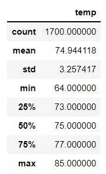
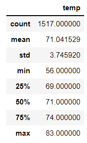

# surfs_up

## Overview of Project
The Client has requested more information about temperature trends before opening the surf shop. Specifically, they want temperature data for the months of June and December in Oahu, in order to determine if the surf and ice cream shop business is sustainable year-round.

## Results
These are the results from the Surfs Up Analysis:

* June
    * Total temperatures: 1,700
    * Avg temperature: 75 degrees
    * Min temperature: 64 degrees
    * Max temperature: 85 degrees
* December
    * Total temperatures: 1,517
    * Avg temperature: 71 degrees
    * Min temperature: 56 degrees
    * Max temperature: 83 degrees

June / December Analysis:

## Summary
The average temperature in Oahu was in the 70s for both June and December. The minimum temperature stayed above 55 for both months, and the maximum was below 85 for both months. I would reccomend running the analysis by seasonal quarters. I would also reccomend adding average rainfail to the analysis. 
